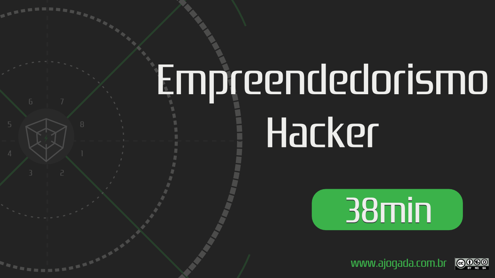

## Sobre o episódio

Neste gaminário,  Rodrigo Arantes e Luciano Santa Brigida apresentam em forma de jogo o que é Ser Hacker e o que é Ser Empreendedor identificando elementos comuns entre estas duas missões de jogo para então apresentar o que é o Empreendedorismo Hacker.

---

### Assista

A imagem abaixo lhe levar&aacute; ao YouTube.

