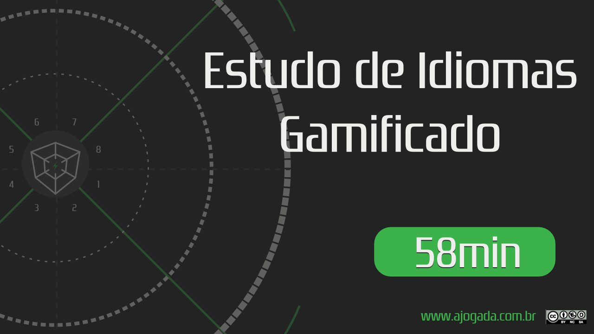

## Sobre o episódio

Neste episódio tivemos a presença especial de Pedro Souza, empresário que está utilizando a metodologia #AJogada no planejamento de sua escola de idiomas. 

Ao longo do episódio mostramos como realizar o aprendizado de praticamente qualquer idioma através de uma metodologia gamificada. 

---

### Assista

A imagem abaixo lhe levar&aacute; ao YouTube.

