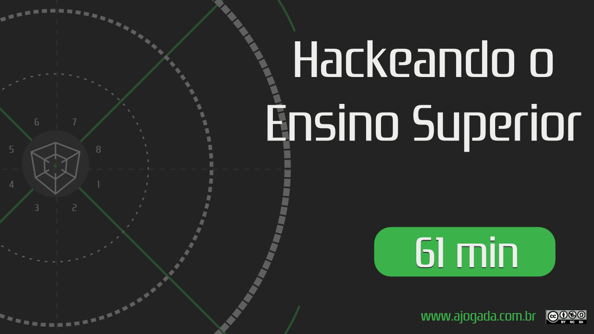

## Sobre o episódio

No gaminário desta semana contamos com a participação do professor Ronald Costa que enriqueceu bastante o jogo com seus comentários e ajudando na construção do tabuleiro. 

Você irá assistir e aprender como você pode hackear sua educação de nível superior compreendendo o que está em jogo nessa missão de aprendizagem.

---

### Assista

A imagem abaixo lhe levar&aacute; ao YouTube.

