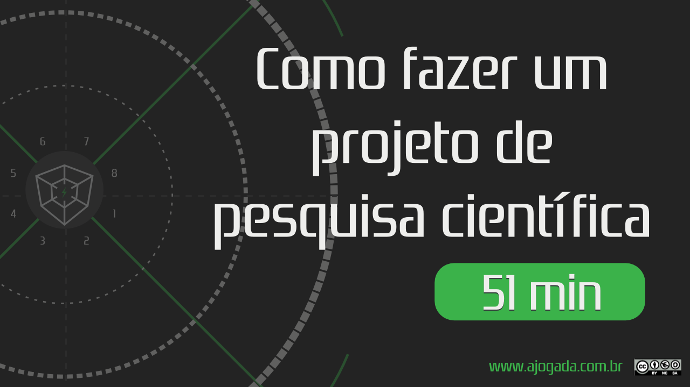

## Sobre o episódio

Neste episódio, mostraremos como gamificar um projeto de pesquisa científica. Seja um TCC ou uma tese de Mestrado, este jogo irá lhe ajudar a se engajar muito mais em sua pesquisa.

---

### Assista

A imagem abaixo lhe levar&aacute; ao YouTube.

